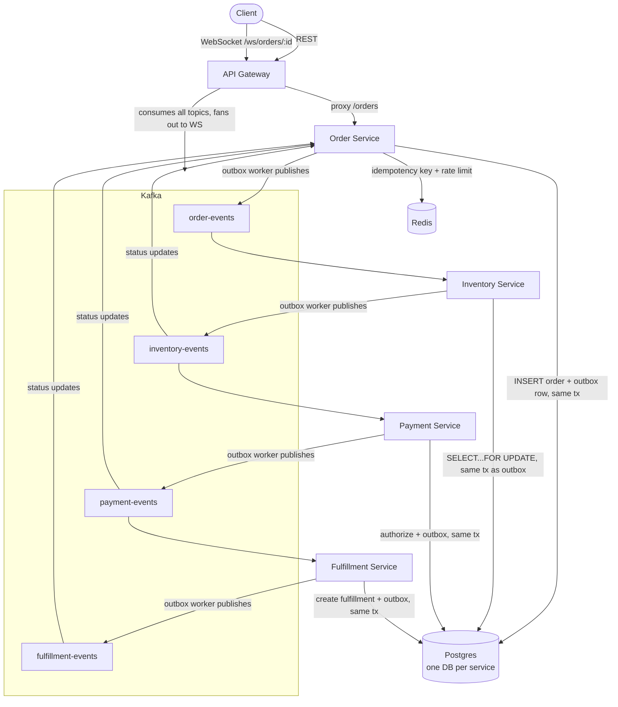

# FulfillX — Architecture

## System diagram



## Request flow: placing an order

```
POST /orders  (via API Gateway → Order Service)
     │
     ├─ Idempotency-Key check (Redis lock, then Postgres durable record)
     ├─ BEGIN
     │    INSERT order, order_items, outbox_event(OrderCreated)
     │  COMMIT
     ├─ 201 response to client (order is PENDING)
     │
     │  (async, from here on)
     ▼
Order Service outbox worker polls unpublished rows → publishes OrderCreated to Kafka
     │
     ▼
Inventory Service consumes OrderCreated
     ├─ processed_events check (dedupe)
     ├─ SELECT ... FOR UPDATE on each SKU (sorted, no deadlocks)
     ├─ enough stock → reserve, outbox InventoryReserved
     │  not enough    → outbox InventoryReservationFailed
     ▼
Payment Service consumes InventoryReserved
     ├─ processed_events check (dedupe)
     ├─ simulate authorization (deterministic per order_id)
     ├─ outbox PaymentAuthorized or PaymentFailed
     ▼
Fulfillment Service consumes PaymentAuthorized
     ├─ processed_events check (dedupe)
     ├─ create fulfillment row
     ├─ outbox FulfillmentCreated, then OrderReadyForShipment
     ▼
Order Service's status-consumer updates orders.status on every hop above,
so GET /orders/:id/status always reflects current state, and the
API Gateway's WebSocket stream pushes each transition to subscribed clients.
```

## Why this shape

**One database per service.** No service ever queries another's
tables directly — the only cross-service contract is the events on
Kafka (documented in `event-contracts.md`). This is what lets each
service be deployed, scaled, and even rewritten independently: the
Payment Service doesn't know or care that Inventory uses Postgres row
locks internally, only that `InventoryReserved` has the shape it
expects.

**Every service that reacts to an event is idempotent, not just the
one that receives client requests.** It's tempting to think
idempotency is only an Order-Service (API-facing) concern. It isn't —
Kafka's at-least-once delivery means Inventory, Payment, and
Fulfillment all have to independently guarantee that redelivery is a
no-op, which is why the same `processed_events` + transaction pattern
appears in all three.

**The API Gateway is intentionally thin.** It does not re-implement
idempotency or rate limiting — those guarantees exist in exactly one
place (Order Service) so there's exactly one source of truth for
them. The gateway's only real logic is the WebSocket fan-out, which
is best-effort by design: losing a WebSocket push never affects the
underlying order processing, only what a connected browser sees in
real time.

## Distributed tracing

Every service instruments its HTTP/consumer entry points with OTel
spans and exports to Jaeger via OTLP. Because the outbox pattern
means "receive event" and "publish next event" happen in different
goroutines (sometimes different processes across a restart), each
outbox row carries a `trace_context` column holding the W3C
traceparent captured at insert time — this is what lets the trace
survive that asynchronous gap and stay one continuous trace all the
way from `POST /orders` to `OrderReadyForShipment`. See the root
README's "How to trace one order across four services" section for
the full mechanism.

## What a Kafka partition-per-order buys us

Every outbox worker publishes with the order ID as the Kafka message
key. Kafka guarantees ordering *within a partition*, and messages
with the same key always land on the same partition — so all events
for one order arrive at each consumer in the order they were
produced, even though different orders can be processed out of order
relative to each other across partitions. This is what makes it safe
for, e.g., Payment to assume `InventoryReserved` for a given order
was already fully processed before it sees that order's ID again.
