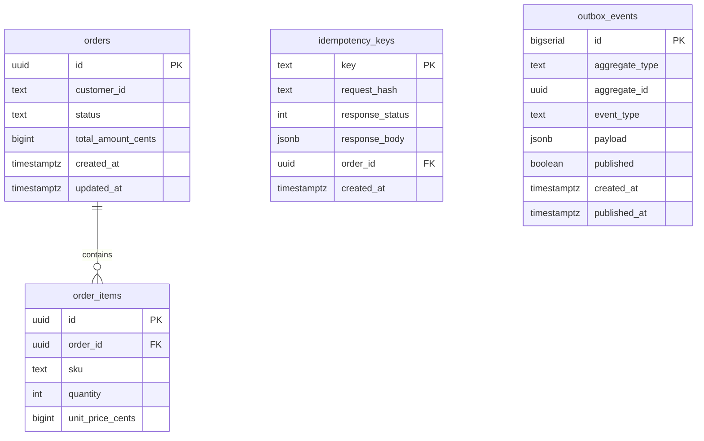
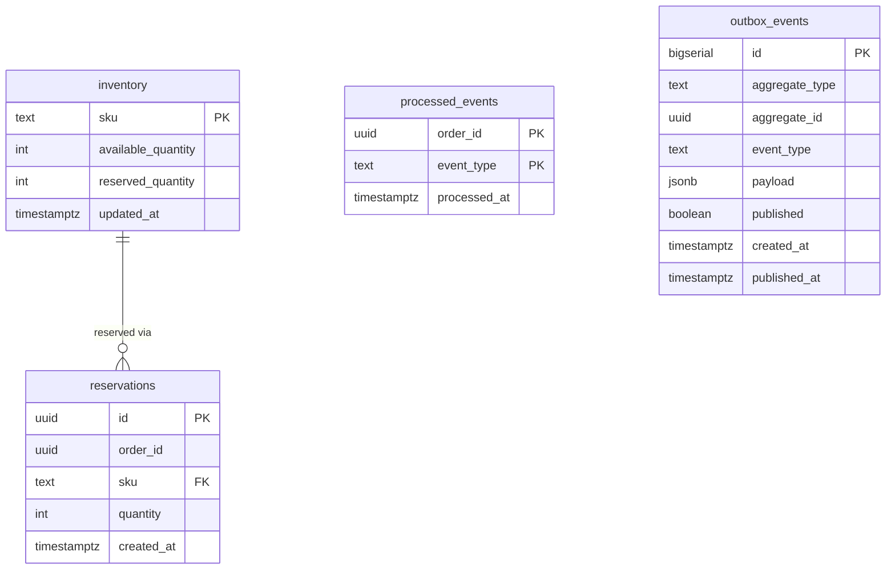
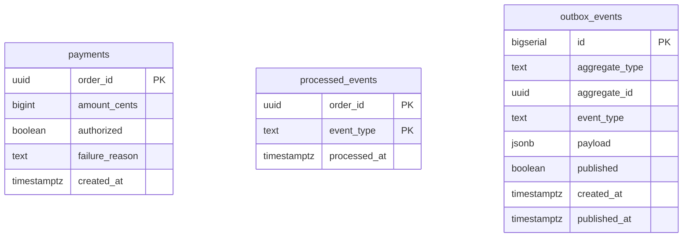
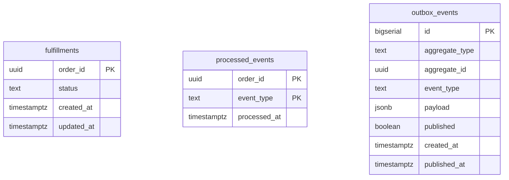

# FulfillX — Database Schema

Each service owns its own Postgres database (`fulfillx_order`,
`fulfillx_inventory`, `fulfillx_payment`, `fulfillx_fulfillment`).
Nothing outside a service's own code ever writes to its tables.

## Order Service — `fulfillx_order`

`orders.status` is written by two different code paths: the order
handler sets it to `PENDING` at creation, and the status-consumer
(reading inventory/payment/fulfillment events) advances it from
there. This is a deliberate exception to "one writer per table" — the
status-consumer only ever calls a single-column `UPDATE`, which is
naturally idempotent, so having two writers doesn't create a
correctness problem the way it would for `total_amount_cents` or
`order_items`.

## Inventory Service — `fulfillx_inventory`

`available_quantity >= 0` is a database-level `CHECK` constraint, not
just an application-level assumption — even a bug that skipped the
row lock would be stopped from writing negative inventory at the
schema layer.

## Payment Service — `fulfillx_payment`

## Fulfillment Service — `fulfillx_fulfillment`

## Recurring pattern: `outbox_events` + `processed_events`

Three of the four databases have an almost-identical pair of tables.
That repetition is intentional, not an oversight — it's the same
correctness pattern applied at every hop in the chain:

- `outbox_events` — write-side guarantee: "this event will be
  published, even if the service crashes right after committing."
- `processed_events` — read-side guarantee: "this event has already
  been handled, so reprocessing it is always safe."

A shared library could factor these out, but each service keeps its
own copy deliberately — see the note in
`inventory-service/internal/models/models.go` about services owning
their own view of the contracts they depend on, rather than sharing
a Go module that would couple their deploy cadence together.
